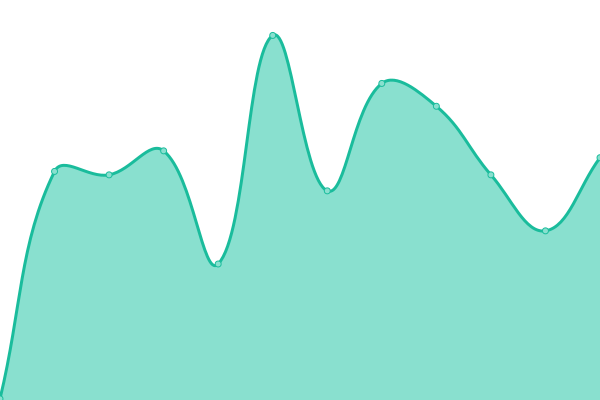

# [📈 Live Status](https://Rapid-Innovation.github.io/infra-yml-web-status-ri): <!--live status--> **🟩 All systems operational**

This repository contains the open-source uptime monitor and status page for [Rapid Innovation](https://www.rapidinnovation.io/), powered by [Upptime](https://github.com/upptime/upptime).

With [Upptime](https://upptime.js.org), you can get your own unlimited and free uptime monitor and status page, powered entirely by a GitHub repository. We use [Issues](https://github.com/Rapid-Innovation/infra-yml-web-status-ri/issues) as incident reports, [Actions](https://github.com/Rapid-Innovation/infra-yml-web-status-ri/actions) as uptime monitors, and [Pages](https://Rapid-Innovation.github.io/infra-yml-web-status-ri) for the status page.

<!--start: status pages-->
<!-- This summary is generated by Upptime (https://github.com/upptime/upptime) -->
<!-- Do not edit this manually, your changes will be overwritten -->
<!-- prettier-ignore -->
| URL | Status | History | Response Time | Uptime |
| --- | ------ | ------- | ------------- | ------ |
|  [Flush frontend](https://flush.com) | 🟩 Up | [flush-frontend.yml](https://github.com/Rapid-Innovation/infra-yml-web-status-ri/commits/HEAD/history/flush-frontend.yml) | 

 192ms
     
 | 

<a href="https://uptime.dev.rapidinnovation.tech/history/flush-frontend">100.00%</a>
    

|  [flush backend](https://api.flush.com) | 🟩 Up | [flush-backend.yml](https://github.com/Rapid-Innovation/infra-yml-web-status-ri/commits/HEAD/history/flush-backend.yml) | 

 136ms
     
 | 

<a href="https://uptime.dev.rapidinnovation.tech/history/flush-backend">100.00%</a>
    

|  [slabs-frontend](https://thewearableinternet.com) | 🟩 Up | [slabs-frontend.yml](https://github.com/Rapid-Innovation/infra-yml-web-status-ri/commits/HEAD/history/slabs-frontend.yml) | 

 278ms
     
 | 

<a href="https://uptime.dev.rapidinnovation.tech/history/slabs-frontend">100.00%</a>
    

|  [slabs-backend](https://api.thewearableinternet.com/api/v1/health) | 🟩 Up | [slabs-backend.yml](https://github.com/Rapid-Innovation/infra-yml-web-status-ri/commits/HEAD/history/slabs-backend.yml) | 

 134ms
     
 | 

<a href="https://uptime.dev.rapidinnovation.tech/history/slabs-backend">100.00%</a>
    

<!--end: status pages-->

[**Visit our status website →**](https://Rapid-Innovation.github.io/infra-yml-web-status-ri)

## 📄 License

- Powered by: [Upptime](https://github.com/upptime/upptime)
- Code: [MIT](./LICENSE) © [Rapid Innovation](https://www.rapidinnovation.io/)
- Data in the `./history` directory: [Open Database License](https://opendatacommons.org/licenses/odbl/1-0/)
